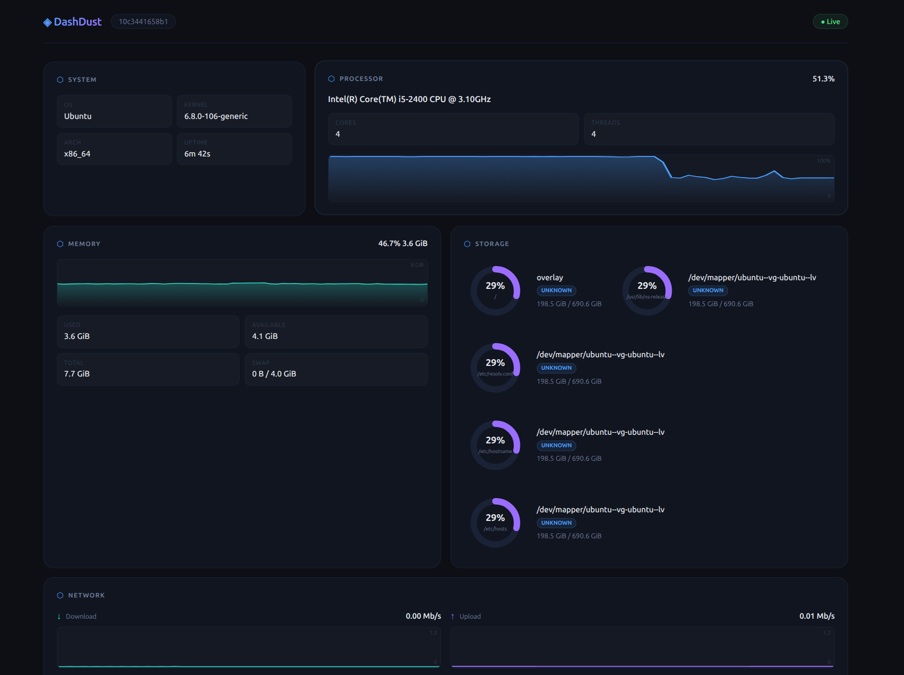
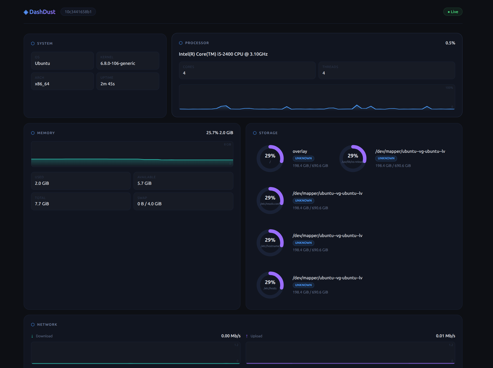

# ◈ DashDust

**DashDust** is a lightweight, real-time server dashboard — built as a faster, leaner alternative to [dashdot](https://github.com/MauriceNino/dashdot).

Where dashdot relies on Node.js and a heavy frontend stack, DashDust is written entirely in **Rust**: the backend collects system metrics natively, and the frontend compiles to **WebAssembly** via [Leptos](https://leptos.dev). The result is a dashboard that uses a fraction of the CPU and memory, while staying just as informative and reactive.

---

## Features

- Real-time metrics via WebSocket (1-second refresh)
- CPU usage — global + per-core, with live graph
- Memory & swap usage, with live graph
- Storage — donut charts per disk (SSD/HDD, mount point, used/total)
- Network — per-interface download/upload speed with live graphs
- System info — OS, kernel, architecture, hostname, uptime
- 60-second history replayed on reconnect
- Single binary + static assets — tiny Docker image (~15 MB)
- No Node.js, no Python, no npm

---

## Screenshots






---

## Tech stack

| Layer    | Technology                              |
|----------|-----------------------------------------|
| Backend  | Rust · Axum · Tokio · sysinfo           |
| Frontend | Rust · Leptos · WebAssembly             |
| Build    | Trunk (WASM bundler) · Docker multi-stage |
| Runtime  | Alpine Linux (musl) — ~15 MB image      |

---

## Why DashDust over dashdot?

| | dashdot | DashDust |
|---|---|---|
| Runtime | Node.js | Native binary (musl) |
| Frontend | Js / Typescript | WebAssembly (Leptos) |
| Base image | ~200 MB+ | ~15 MB |
| Idle CPU | ~1–3 % | < 0.1 % |
| Idle RAM | ~80–150 MB | ~5–10 MB |
| WebSocket history | — | 60 s replay on connect |

---

## Production deployment

### Requirements

- Docker ≥ 24 and Docker Compose v2, or Portainer

---

### Option 1 — Docker Compose

1. Copy the compose file to your server:

```yaml
# docker-compose.yml
services:
  dashdust:
    image: .
    container_name: dashdust
    restart: unless-stopped
    ports:
      - "3300:3000"
    volumes:
      - /etc/os-release:/etc/os-release:ro
    security_opt:
      - no-new-privileges:true
    tmpfs:
      - /tmp:noexec,nosuid,size=10m
```

2. Start it:

```bash
docker compose up -d
```

3. Open `http://<your-server-ip>:3300` in your browser.

> To build the image locally instead of pulling, replace `image:` with `build: .` and run `docker compose up -d --build`.

---

### Option 2 — Portainer (Stack)

1. In Portainer, go to **Stacks → Add stack**.
2. Name it `dashdust`.
3. Paste the Compose YAML from above into the **Web editor**.
4. Click **Deploy the stack**.
5. Once deployed, open `http://<your-server-ip>:3300`.

#### Behind a reverse proxy (Nginx / Traefik)

If you expose DashDust over HTTPS, the frontend automatically switches to `wss://` for the WebSocket connection — no extra configuration needed.

**Nginx example:**

```nginx
server {
    listen 443 ssl;
    server_name dashdust.example.com;

    location / {
        proxy_pass http://localhost:3300;
        proxy_http_version 1.1;
        proxy_set_header Upgrade $http_upgrade;
        proxy_set_header Connection "upgrade";
        proxy_set_header Host $host;
    }
}
```

**Traefik label example (add to the compose service):**

```yaml
labels:
  - "traefik.enable=true"
  - "traefik.http.routers.dashdust.rule=Host(`dashdust.example.com`)"
  - "traefik.http.routers.dashdust.entrypoints=websecure"
  - "traefik.http.services.dashdust.loadbalancer.server.port=3000"
```

---

### Building from source

```bash
# Prerequisites: Rust stable, wasm32-unknown-unknown target, Trunk
rustup target add wasm32-unknown-unknown
cargo install trunk

# Build frontend
cd frontend && trunk build --release && cd ..

# Build backend
cargo build --release --package backend

# Run (serves frontend from ./dist)
cp -r frontend/dist ./dist
./target/release/backend
```

Or just use Docker:

```bash
docker build -t dashdust .
docker run -p 3300:3000 -v /etc/os-release:/etc/os-release:ro dashdust
```

---

## Try a demo

[dashdust](https://dashdust.evanhgs.fr/)

## License

MIT License

Copyright (c) 2026 Evan

Permission is hereby granted, free of charge, to any person obtaining a copy
of this software and associated documentation files (the "Software"), to deal
in the Software without restriction, including without limitation the rights
to use, copy, modify, merge, publish, distribute, sublicense, and/or sell
copies of the Software, and to permit persons to whom the Software is
furnished to do so, subject to the following conditions:

The above copyright notice and this permission notice shall be included in all
copies or substantial portions of the Software.

THE SOFTWARE IS PROVIDED "AS IS", WITHOUT WARRANTY OF ANY KIND, EXPRESS OR
IMPLIED, INCLUDING BUT NOT LIMITED TO THE WARRANTIES OF MERCHANTABILITY,
FITNESS FOR A PARTICULAR PURPOSE AND NONINFRINGEMENT. IN NO EVENT SHALL THE
AUTHORS OR COPYRIGHT HOLDERS BE LIABLE FOR ANY CLAIM, DAMAGES OR OTHER
LIABILITY, WHETHER IN AN ACTION OF CONTRACT, TORT OR OTHERWISE, ARISING FROM,
OUT OF OR IN CONNECTION WITH THE SOFTWARE OR THE USE OR OTHER DEALINGS IN THE
SOFTWARE.
